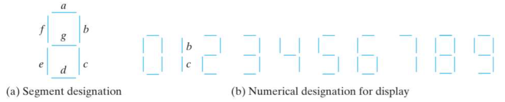

# 2-bit Adder to Seven Segment Display

This is an implementation of a 2-bit ripple carry adder in System Verilog. 
Two full adders were used to make the 2-bit ripple carry adder.

The sum is displayed on a BCD-to-seven-segment decoder.  

